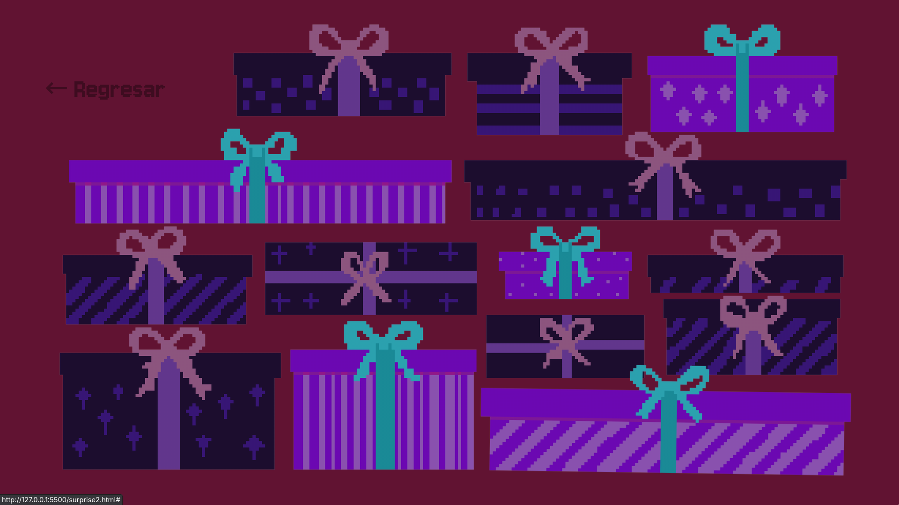
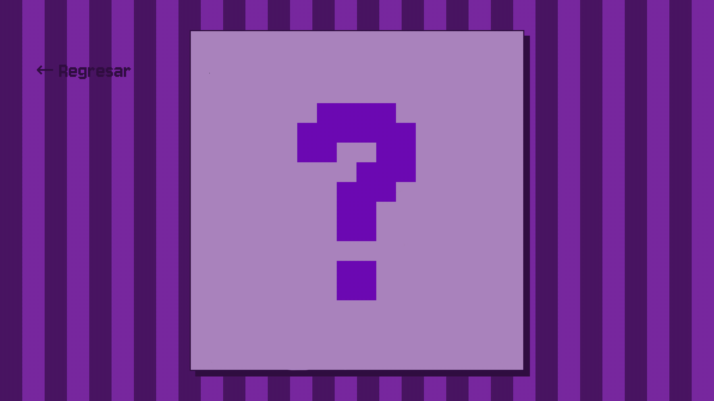

# Happy  [**˗ˏˋ ★click aquí★ ˎˊ˗**](https://kasinfire.github.io/Happy/index.html)

Página web de cumpleaños interactiva con un osito, confetti, una carta
oculta (codificada) y una escena de regalos sorpresa que triste mente no pude acabar.

**Conceptos de DOM utilizados:**
- `document.getElementById()` y `classList.toggle()` para revelar al osito.
- Manipulación dinámica de contenido con `innerText`.
- `getBoundingClientRect()` para lanzar el confetti desde la posición exacta del osito.
- `fetch()` + decodificación Base64 para cargar el mensaje de la carta sin exponerlo en el HTML.
- `clip-path` combinado con enlaces (`<a>`) para crear zonas clicables irregulares sobre una sola imagen.
- Canvas API (`requestAnimationFrame`) para el sistema de partículas del confetti.

**Archivos:**
```
index.html
├── surprise.html
├── surprise2.html
│
├── styles/
│   ├── theme.css
│   ├── surprise.css
│   └── surprise2.css
│
├── scripts/
│   ├── main.js
│   ├── confetti.js
│   └── decoder.js
│
├── text/
│   └── text.json
│
└── assets/
```





ꕤ* [**Link**](https://kasinfire.github.io/Happy/index.html)

## (*ᴗ͈ˬᴗ͈)ꕤ*.ﾟ ¿Cómo funciona?

**1.** `index.html` — Aparece el osito. Al hacer clic sobre él (fuera de
sus brazos), se "asusta", suelta confetti y extiende los brazos,
revelando dos enlaces:
   • Brazo derecho → lleva a `surprise.html` — la carta.
   • Brazo izquierdo → lleva a `surprise2.html` — los regalos.

**2.** `surprise.html` — Muestra una carta con el mensaje de cumpleaños.
El texto real está guardado codificado en Base64 dentro de
`text/text.json`, y `decoder.js` lo decodifica en el navegador antes
de mostrarlo.

**3.** `surprise2.html` — Una escena con 5 regalos dibujados sobre una
sola imagen de fondo (`presentsBgr.png`). Cada regalo es un área
clicable (`clip-path`) recortada sobre esa imagen — puedes ligar cada
uno a lo que quieras (otra sorpresa, una foto, un mensaje, etc.),
actualmente apuntan a `#` como placeholder.

Todas las páginas tienen un botón "← Regresar" para volver a `index.html`.

## ✩ Qué puedes personalizar tú

| Quiero cambiar...                      | Dónde lo edito |
|----------------------------------------|----------------|
| El mensaje de la carta                 | Vuelve a codificar el texto en Base64 y reemplaza el valor `text` en `text/text.json` |
| Los colores de cada página             | Las variables `:root` al inicio de cada archivo `.css` (`--bg--color`, `--border`, etc.) |
| El destino de cada regalo              | El `href="#"` de cada `<a class="gift__link ...">` en `surprise2.html` |
| Las imágenes (osito, regalos, fondo)   | Reemplaza los archivos en `assets/`, manteniendo el mismo nombre; si cambias `presentsBgr.png`, ajusta el `aspect-ratio` en `surprise2.css` según las nuevas dimensiones |
| El color/grosor de las rayas de fondo  | El `repeating-linear-gradient` en el `body` de `surprise.css` |

## ✩ Notas importantes

• Proyecto pensado solo para laptop / escritorio. En pantallas de
  celular se muestra un mensaje avisando que hay que abrir la página
  desde una computadora — ver media query en `theme.css`.

• `surprise.html` necesita que `decoder.js` pueda hacer un `fetch` a
  `text/text.json`. Si abres el archivo `.html` directo desde tu
  computadora (`file://`) sin un servidor local, el navegador puede
  bloquear ese `fetch` por seguridad. Lo más fácil es correr un
  servidor local sencillo (por ejemplo, con la extensión "Live Server"
  de VS Code) o subir el proyecto a un hosting.

---

## Tecnologías
- HTML5
- CSS3 (variables CSS, animaciones, media queries, clip-path)
- JavaScript (Vanilla, sin frameworks)

## ₊˚⊹♡ Autor
[Kasinfire](https://github.com/Kasinfire)